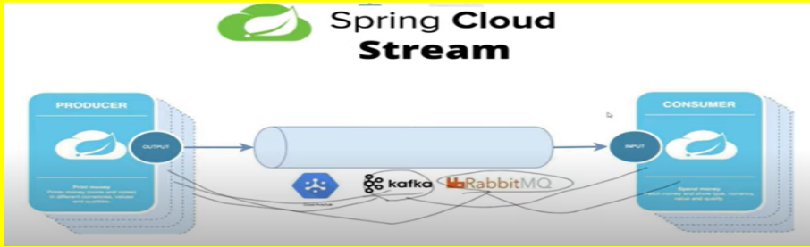
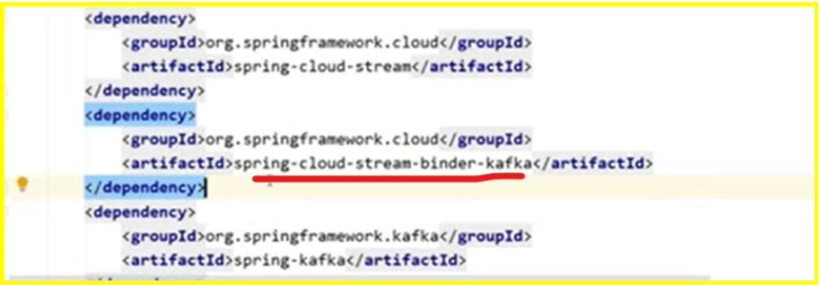

# spring-cloud-stream-example-binder


Basically we're not tied anymore to the message broker leveraging on the **spring-cloud-stream** dependency 



It's just enough change dependencies from **spring-cloud-stream-binder-kafka** to another binder.



In the java classes **@EnableBinding(Source.class)** stands for the publisher and **@EnableBinding(Sink.class)** for the consumer


###### Apache-Kafka Binary Distribution [Download](actual link: https://archive.apache.org/dist/kafka/2.3.1/kafka_2.11-2.3.1.tgz).

###### Start Zookeeper server
> zookeeper-server-start.bat <local_path>\config\zookeeper.properties

###### Start Kafka server 
> kafka-server-start.bat <local_path>\config\server.properties

###### Create Topic
> kafka-topics.bat --create --zookeeper localhost:2181 --replication-factor 1 --partitions 1 -topic queue-test

###### List down all available topics
> kafka-topics.bat --list --zookeeper localhost:2181

###### Produce a message
> kafka-console-producer.bat --broker-list localhost:9092 --topic queue-test

###### Consume a message
> kafka-console-consumer.bat --bootstrap-server localhost:9092 --topic queue-test


References: https://hub.docker.com/r/bitnami/kafka

References: https://www.youtube.com/watch?v=1IgvFlyEPkY


## Running Kafka on docker:

```
curl -sSL https://raw.githubusercontent.com/bitnami/containers/main/bitnami/kafka/docker-compose.yml > docker-compose.yml
docker-compose up -d
docker ps 
docker exec -it "ID_KAFKA_CONTAINER" bash
#in case would be necessary to find the right folder
find . -name "kafka-topics*"
cd /opt/bitnami/kafka/bin/
#Create a topic, note that in the last kafka version zookeeper option is deprecated ! use instead "bootstrap-server"
./kafka-topics.sh --create --bootstrap-server localhost:9092 --replication-factor 1 --partitions 1 -topic queue-test
./kafka-topics.sh --list --bootstrap-server localhost:9092
```